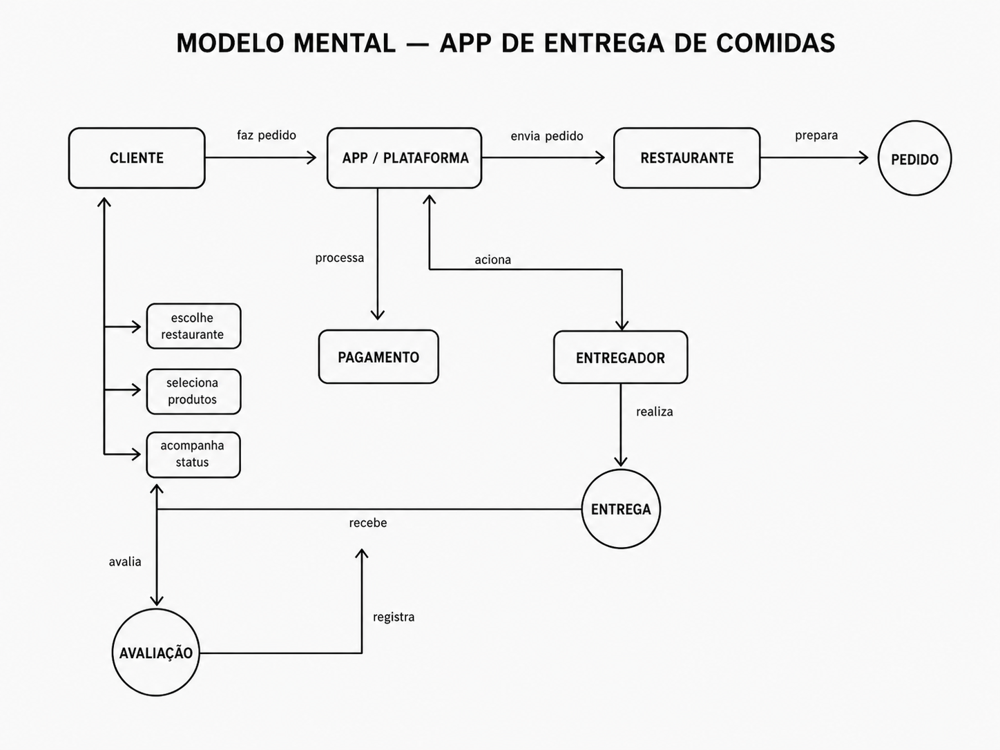

# Atividade – Conceitos Básicos  
## Aplicação de Entrega de Comidas

## 1. Cenário de uso

Em uma aplicação de entrega de comidas, o cliente acessa o aplicativo, escolhe um restaurante, seleciona os itens do cardápio e confirma o pedido informando endereço e forma de pagamento.

Depois disso, o sistema envia o pedido ao restaurante, que pode aceitar ou recusar. Caso aceite, o restaurante prepara a comida e atualiza o status do pedido. Em seguida, o sistema localiza um entregador disponível, que retira o pedido no restaurante e realiza a entrega ao cliente.

Durante todo o processo, o cliente acompanha os status, como: pedido recebido, em preparo, saiu para entrega e entregue. Ao final, o pedido é concluído e o cliente pode avaliar o restaurante e o entregador.

---

## 2. Elementos envolvidos

## Atores

- **Cliente:** realiza o pedido, paga e acompanha a entrega.
- **Restaurante:** recebe, aceita e prepara o pedido.
- **Entregador:** retira o pedido no restaurante e entrega ao cliente.
- **Sistema/Plataforma:** conecta cliente, restaurante e entregador.
- **Gateway de pagamento:** processa o pagamento do pedido.

---

## Produtos e artefatos

- **Pedido:** contém itens, valor, endereço, cliente, restaurante e status.
- **Carrinho:** armazena os itens antes da confirmação.
- **Pagamento:** registra a forma e a confirmação da transação.
- **Status do pedido:** indica a etapa atual do processo.
- **Entrega:** relaciona o pedido ao entregador.
- **Avaliação:** feedback do cliente após a entrega.

---

## Ações permitidas

### Cliente
- consultar restaurantes;
- escolher produtos;
- confirmar pedido;
- pagar;
- acompanhar entrega;
- avaliar o serviço.

### Restaurante
- receber pedido;
- aceitar ou recusar;
- preparar comida;
- avisar quando estiver pronto.

### Entregador
- aceitar entrega;
- retirar pedido;
- entregar ao cliente;
- atualizar status.

### Sistema
- registrar pedidos;
- processar pagamentos;
- enviar notificações;
- localizar entregador;
- atualizar status.

---

## Relacionamentos

- O **cliente** cria um **pedido** pelo **sistema**.
- O **sistema** envia o pedido ao **restaurante**.
- O **restaurante** prepara o pedido.
- O **sistema** associa um **entregador** ao pedido.
- O **entregador** retira o pedido no restaurante.
- O **entregador** entrega ao **cliente**.
- O **cliente** avalia o serviço ao final.

---

## Resumo

A aplicação funciona como uma plataforma intermediadora entre cliente, restaurante e entregador. O sistema coordena o pedido, o pagamento, a preparação, a entrega e a avaliação final.

---

## 3. Diagrama ilustrativo do modelo mental

A partir do modelo mental desenvolvido, foi criado um diagrama ilustrativo para representar, de forma simples e visual, o funcionamento de uma aplicação de entrega de comidas.

O diagrama apresenta os principais elementos envolvidos no sistema, como **cliente**, **aplicativo/plataforma**, **restaurante**, **pagamento**, **entregador**, **entrega** e **avaliação**. Além disso, mostra as relações entre esses elementos, indicando como o pedido passa por cada etapa até ser entregue ao cliente.

O fluxo representado no diagrama pode ser entendido da seguinte forma: o **cliente** realiza o pedido pelo **aplicativo/plataforma**, escolhendo restaurante e produtos. Em seguida, o sistema processa o **pagamento** e envia o pedido ao **restaurante**, que prepara a comida. Depois, o sistema aciona o **entregador**, que realiza a **entrega** ao cliente. Ao final, o cliente pode registrar uma **avaliação** sobre o serviço.

Esse modelo ajuda a visualizar de maneira clara os principais atores, ações e relacionamentos existentes em uma aplicação de entrega de comidas.
