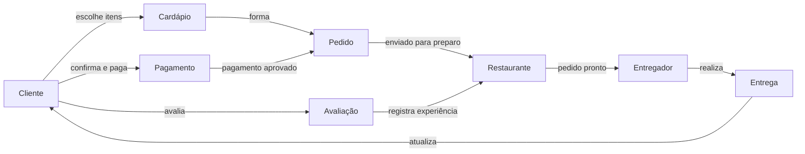

# Conceitos básicos (2)

## Objetivo

Representar visualmente meu modelo mental de uma aplicação de entrega de comida e refletir sobre os limites dessa representação.

## Enunciado

Com base no cenário de uma aplicação de entrega de comida estudado anteriormente:

1. criar um diagrama ilustrativo do modelo mental desenvolvido;
2. quando possível, comparar o modelo com o de outro estudante, apontando semelhanças e diferenças.

## Meu modelo mental

Eu entendo esse tipo de aplicação como uma ponte entre quem quer pedir comida, o estabelecimento que prepara o pedido e a pessoa responsável pela entrega. O pedido é o elemento que conecta essas partes: ele começa com a escolha dos itens, passa pela confirmação e pelo pagamento, entra em preparação e termina na entrega e na avaliação.

Além do fluxo principal, considero importante que cada participante enxergue apenas o que precisa para realizar sua parte. O cliente acompanha o pedido; o restaurante recebe e prepara; o entregador recebe a coleta e o destino; e a aplicação coordena pagamento, atualizações e histórico.

## Diagrama ilustrativo

O diagrama não pretende representar todos os serviços internos de uma plataforma real. Ele resume os elementos que considero essenciais para explicar o caminho de um pedido, desde a escolha até a conclusão da entrega.

## Comparação com outros modelos

Nesta entrega eu não incluí uma comparação detalhada com o modelo de outro estudante, pois não mantive um registro suficiente dessa comparação para apresentá-la com segurança agora. Ainda assim, imagino que modelos diferentes possam variar principalmente no foco: alguns podem dar mais destaque ao pagamento e à logística, enquanto outros podem detalhar o catálogo, as promoções ou as avaliações.

## Reflexão

Ao desenhar o fluxo, percebi que a palavra “pedido” concentra muitos estados e responsabilidades. Em uma versão mais detalhada, eu separaria melhor situações como pedido criado, pagamento recusado, preparo iniciado, entrega em rota e pedido concluído. Esse exercício mostrou que o diagrama ajuda a encontrar dúvidas antes de transformar o modelo em código.
