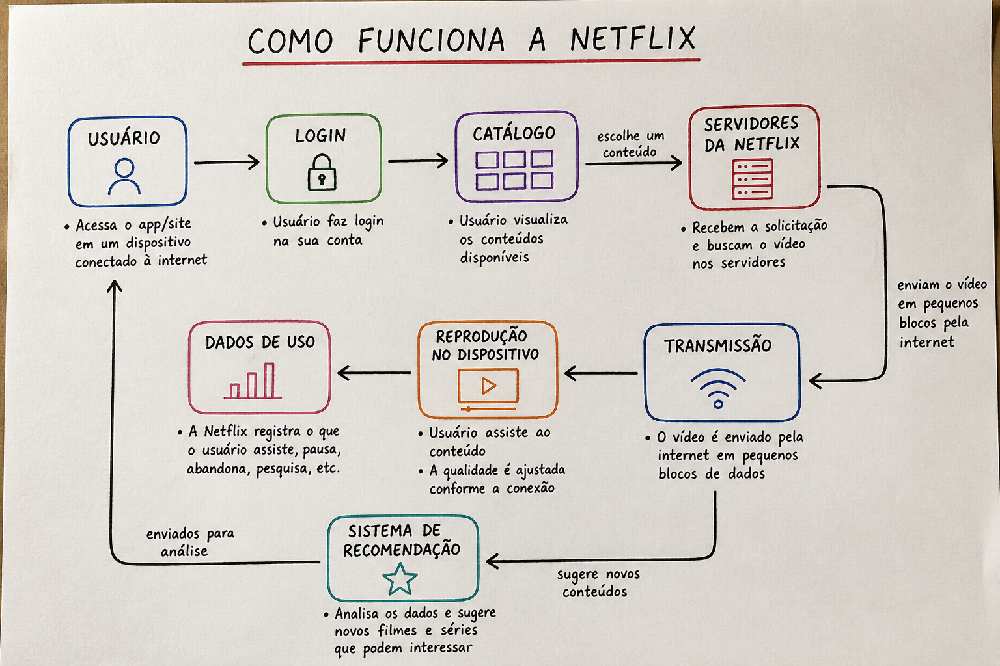

# Exemplos ilustrativos  
## Atividade:: Como funciona a Netflix? (1)

Pense a respeito do funcionamento de um serviço de streaming como a Netflix.

## Como você explicaria o seu funcionamento para alguém?

A Netflix funciona como uma plataforma de streaming de vídeos. Primeiro, o usuário acessa o aplicativo ou o site da Netflix usando um celular, computador, televisão ou outro dispositivo conectado à internet.

Depois disso, o usuário faz login em sua conta e visualiza o catálogo de conteúdos disponíveis, como filmes, séries, documentários e animações. Ao escolher um conteúdo, a plataforma solicita esse vídeo aos servidores da Netflix.

Os servidores enviam o vídeo pela internet em pequenas partes, permitindo que o usuário comece a assistir sem precisar baixar o arquivo completo. Enquanto o vídeo é reproduzido, a Netflix ajusta automaticamente a qualidade da imagem de acordo com a velocidade da conexão do usuário.

Durante o uso, a plataforma também registra informações sobre os conteúdos assistidos, pausados, pesquisados ou abandonados. Esses dados ajudam o sistema a recomendar novos filmes e séries de acordo com o gosto do usuário.

Assim, de forma geral, a Netflix funciona conectando o usuário a um catálogo digital, transmitindo vídeos pela internet e utilizando dados de uso para personalizar a experiência.

---

## Tente sintetizar e expressar seu entendimento na forma de um modelo em papel.

O diagrama abaixo representa de forma resumida o caminho entre o acesso do usuário, o catálogo, a reprodução do conteúdo e as recomendações.

