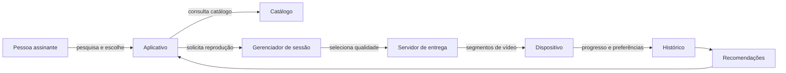

# Como funciona a Netflix? (2)

## Identificação

- Aula: 1.2
- Tema: modelo mental de um serviço de streaming
- Tipo: representação visual

## Enunciado

Sintetizar o funcionamento de um serviço de streaming em um modelo que torne explícitos os participantes e o fluxo principal.

## Solução

## Análise e justificativa

O desenho separa catálogo, sessão e entrega de mídia porque essas responsabilidades não são a mesma coisa. A qualidade escolhida depende das condições de rede e o histórico é uma fonte para recomendações, não uma condição para assistir. O modelo é deliberadamente simplificado: não representa contratos de distribuição, cobrança nem moderação de conteúdo.

## Resultado

O modelo permite explicar o caminho de uma escolha até a reprodução sem confundir o aplicativo com toda a infraestrutura do serviço.

## Reflexão pessoal

Transformar a explicação em setas deixou claro que “assistir” envolve mais componentes do que apenas apertar um botão. A principal dificuldade foi decidir o que omitir sem quebrar a ideia central.

## Referências

- Material da Aula 1.2 — Modelos Mentais e Conhecimento Compartilhado.

