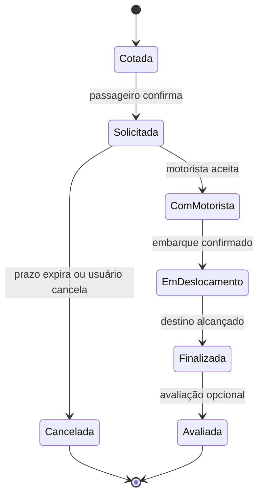

# Como funciona a Uber? (2)

## Identificação

- Aula: 1.2
- Tema: representação de estados
- Tipo: diagrama Mermaid

## Enunciado

Representar um recorte do ciclo de vida de uma solicitação de corrida.

## Solução

## Análise e justificativa

Estados evitam combinações inválidas, como registrar uma avaliação antes de uma corrida finalizada. A cotação foi separada da solicitação porque consultar uma estimativa não cria, por si só, um compromisso de atendimento.

## Resultado

O diagrama serve de base para conversas sobre regras, notificações e eventos que devem ocorrer em cada mudança de estado.

