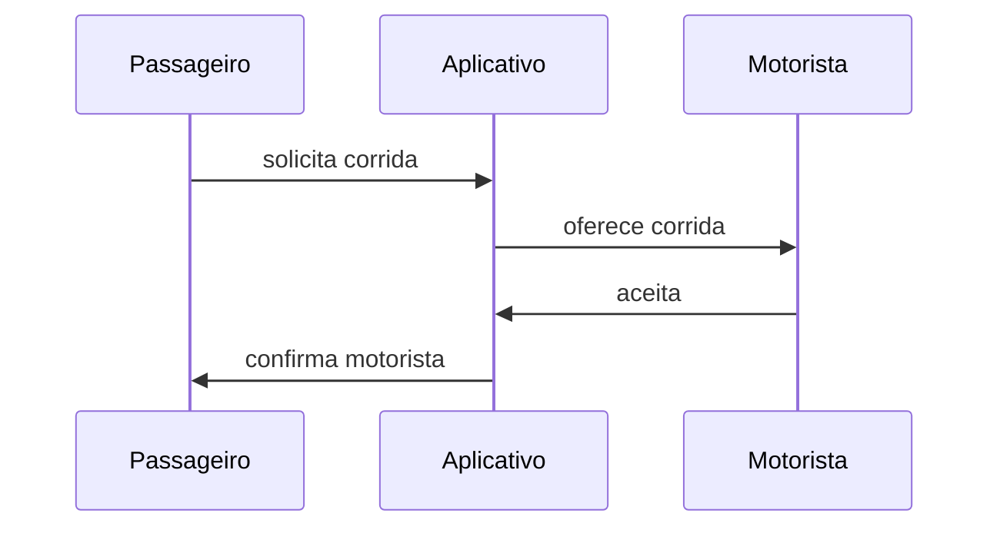

# Modelos Mentais (1)

## Identificação

- Aula: 1.2
- Tema: divergência de entendimento
- Tipo: estudo de caso

## Enunciado

Identificar modelos mentais distintos em uma situação cotidiana de software.

## Solução

Eu escolhi recriar o fluxo de uma corrida em Mermaid. Para mim, a ferramenta permite guardar o diagrama como texto, revisar mudanças e visualizar relações básicas com rapidez.

Comparado a um esboço em papel, o Mermaid mantém alinhamento e facilita alteração. A limitação é que exige aprender uma sintaxe e oferece menos liberdade para anotações visuais espontâneas.
