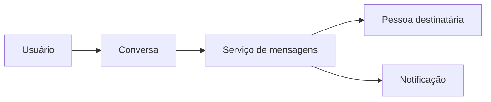

# Modelos Mentais (2)

## Identificação

- Aula: 1.2
- Tema: conhecimento compartilhado
- Tipo: proposta de alinhamento

## Enunciado

Propor uma prática para transformar entendimentos individuais em conhecimento compartilhado.

## Solução

Eu escolhi o WhatsApp como plataforma popular. No meu modelo mental básico, incluí pessoa usuária, conversa, mensagem, servidor e notificação. Diferentemente de uma plataforma de streaming, entendi que o fluxo principal não é reproduzir catálogo, mas enviar e confirmar comunicação entre participantes.

O exercício reforçou para mim que os mesmos recursos de modelagem usados para Netflix e Uber podem ser aplicados a outro domínio, mas os elementos relevantes mudam conforme o objetivo do sistema.
