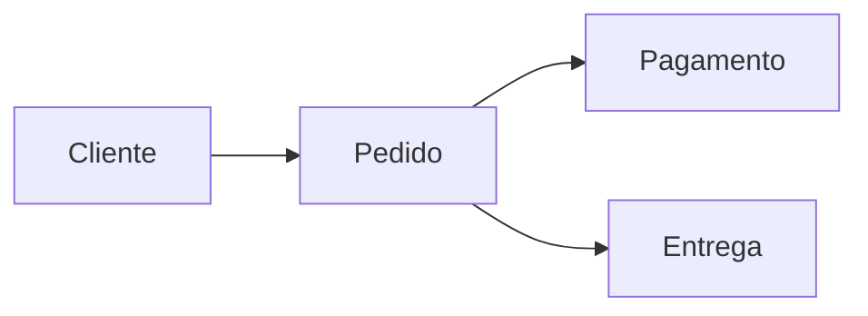

# Origens e Evolução (2)

## Propósito e relevância atual

Na análise estruturada, o objetivo principal era decompor processos e deixar claro por onde os dados passavam. Essa abordagem continua útil quando eu preciso explicar integrações simples ou fluxos administrativos. O modelo entidade-relacionamento surgiu para representar informações persistentes e ainda é relevante no projeto de bancos de dados.

Com a orientação a objetos e a UML, passou a ser possível representar responsabilidades, mensagens e estados de elementos do sistema. Eu considero essa visão útil quando preciso discutir comportamento, embora eu não ache necessário criar todos os tipos de diagramas em projetos pequenos.

As abordagens mais recentes, como DDD e Event Storming, dão mais atenção ao vocabulário compartilhado e aos acontecimentos do domínio. Para mim, elas são especialmente úteis quando termos do negócio têm significados diferentes para áreas distintas.

## Exemplos de modelos e ferramentas

| Técnica | Modelo que pode ser gerado | Ferramenta possível |
|---|---|---|
| Análise estruturada | DFD de confirmação de pedido | diagrams.net ou PlantUML |
| Modelo ER | entidades Pedido, Cliente e Pagamento | ferramenta de modelagem de banco |
| UML | diagrama de classes ou de sequência | PlantUML |
| DDD | mapa de contextos delimitados | ContextMapper ou Mermaid |
| Event Storming | linha de eventos de uma reserva | quadro colaborativo ou cartões físicos |

## Exemplo ilustrativo

Eu usei esse modelo simples para ilustrar como uma mesma situação pode ser vista pelo fluxo de dados, pelo relacionamento entre conceitos ou pelos eventos que acontecem depois da confirmação do pedido.

## Conclusão

Eu concluo que a modelagem evoluiu de representações mais focadas em processos e dados para abordagens que também valorizam comportamento, linguagem e colaboração. Mesmo assim, eu escolheria a técnica de acordo com a pergunta que preciso responder, e não por ela ser a mais nova.

## Referências

- Object Management Group. *Unified Modeling Language (UML).*
- Chen, P. P.-S. *The Entity-Relationship Model—Toward a Unified View of Data.*
- Evans, E. *Domain-Driven Design.*
