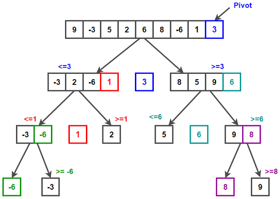
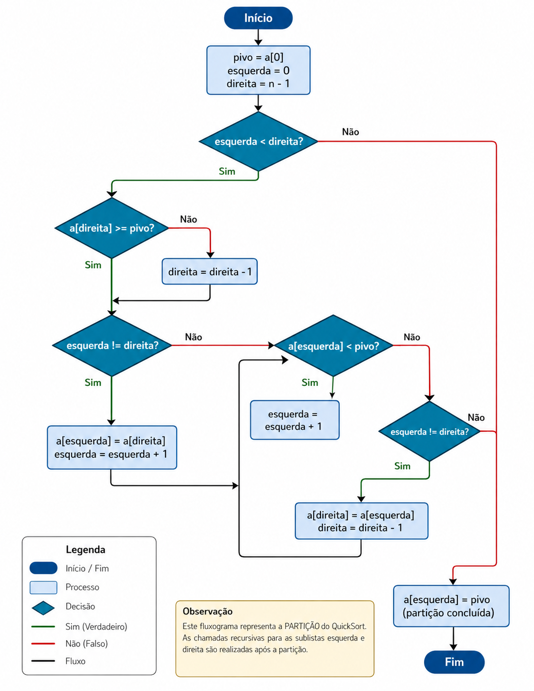

# EXEMPLO: MODELOS COMPUTACIONAIS

## Algoritmo escolhido: QuickSort

---

## 1. Considerando um segundo algoritmo de ordenação (QuickSort), explique usando diferentes perspectivas

### 1.1 Linguagem natural

A partir da análise do algoritmo, entendi que o **QuickSort** organiza um vetor escolhendo um **pivô** (no exemplo, o último elemento).

Depois disso, ele separa os elementos em dois grupos:

- valores **menores que o pivô** ficam à esquerda;
- valores **maiores que o pivô** ficam à direita.

Esse processo é repetido para cada novo subvetor gerado, até que não seja mais possível dividir. No final, todos os elementos acabam organizados da esquerda para a direita.

---

### 1.2 Diagrama livre



---

### 1.3 Pseudo-código

```text
função quickSort(vetor, inicio, fim)
    se inicio < fim então
        pivo = particiona(vetor, inicio, fim)
        quickSort(vetor, inicio, pivo - 1)
        quickSort(vetor, pivo + 1, fim)
    fim se
fim função

função particiona(vetor, inicio, fim)
    pivo = vetor[fim]
    i = inicio - 1

    para j de inicio até fim - 1 faça
        se vetor[j] < pivo então
            i = i + 1
            trocar vetor[i] com vetor[j]
        fim se
    fim para

    trocar vetor[i + 1] com vetor[fim]
    retornar i + 1
fim função
```

---

### 1.4 Diagrama formal (DFD)



---

## 2. Comparação das perspectivas

### Linguagem natural

Mais fácil de entender no início, pois explica a ideia geral do algoritmo de forma simples.

### Diagrama livre

Ajuda bastante na visualização do processo, mostrando como o vetor é dividido.

### Pseudo-código

Mais técnico, exige conhecimento de programação, mas é essencial para implementar.

### Diagrama formal (DFD)

Mais estruturado e usado em modelagem, porém exige mais conhecimento para interpretar.

---

## Conclusão

Cada forma de representação ajuda de um jeito diferente. A linguagem natural facilita o entendimento inicial, o diagrama livre ajuda a visualizar, o pseudo-código mostra como implementar e o DFD organiza o processo de forma mais formal.

Por isso, usar várias representações juntas torna o aprendizado mais completo.
