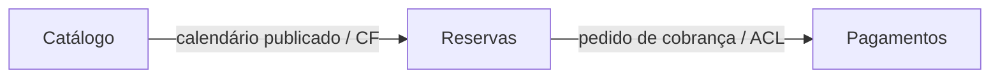

# ContextMapper

## Identificação

- Aula: 5.1
- Tema: mapa de contextos
- Tipo: CML e diagrama Mermaid

## Solução

O arquivo [`reservae.cml`](reservae.cml) descreve três contextos do Reservaê. Como a ferramenta ContextMapper não está instalada no ambiente, a sintaxe não foi validada nela; o diagrama abaixo é a representação complementar revisada manualmente.

O Catálogo publica informações de hospedagens e períodos. Reservas decide conflitos, expiração e confirmação. Pagamentos traduz a solicitação de cobrança para o contrato externo, protegendo o modelo de reservas de detalhes do provedor.

## Resultado

O mapa torna explícito que os três contextos podem evoluir separadamente, embora cooperem no fluxo de reserva.

