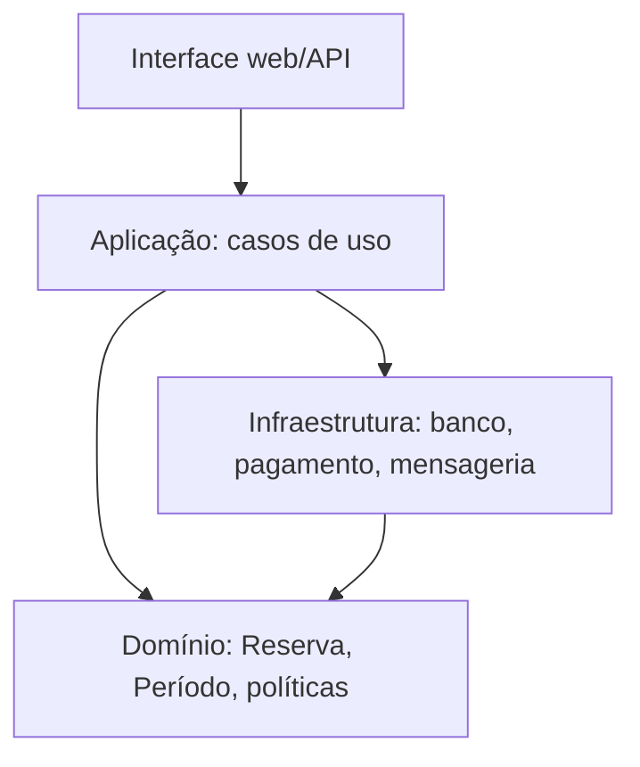

# Arquitetura (1)

## Identificação

- Aula: 7.2
- Tema: arquitetura e modelo de domínio
- Tipo: proposta arquitetural

## Solução

Para o Reservaê, uma arquitetura em camadas preserva o modelo de reservas no centro:

A camada de aplicação orquestra casos como `confirmarReserva`, mas não decide se períodos conflitam. Essa regra pertence ao domínio. Infraestrutura implementa persistência e adaptadores de pagamento sem determinar a linguagem do negócio.

## Reflexão pessoal

A separação ajuda a trocar detalhes técnicos sem reescrever regras centrais. A dificuldade está em não transformar a camada de aplicação em um novo lugar para regras de negócio.

